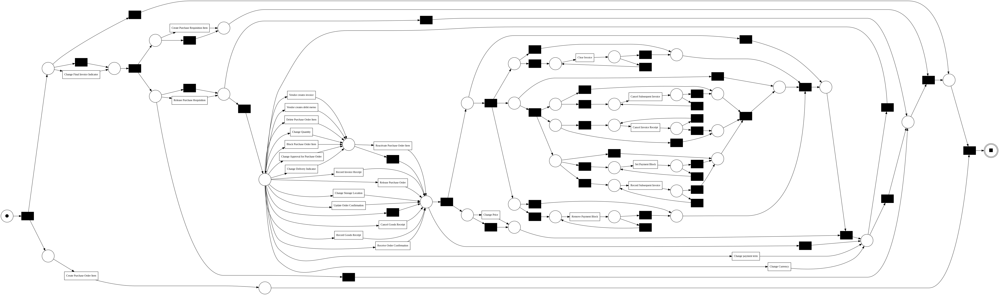
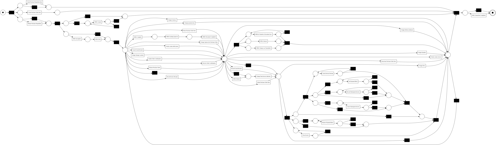
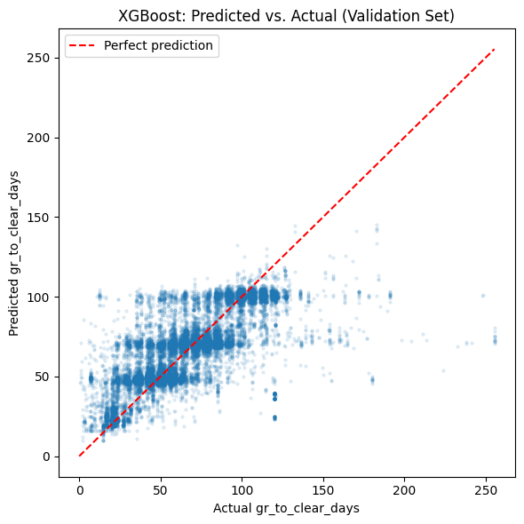
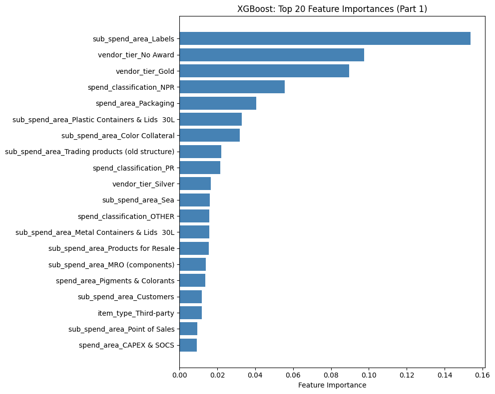
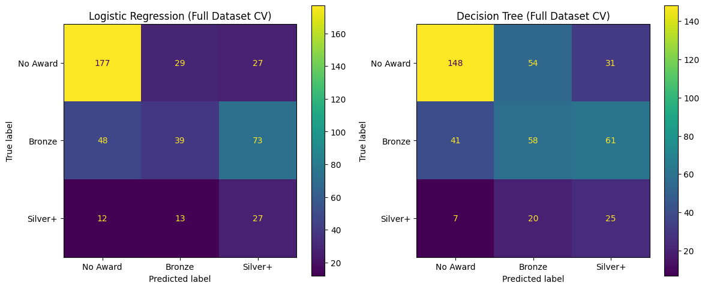
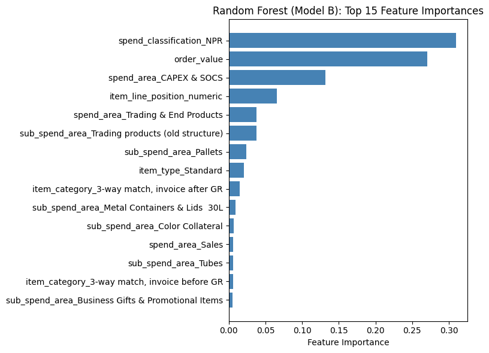
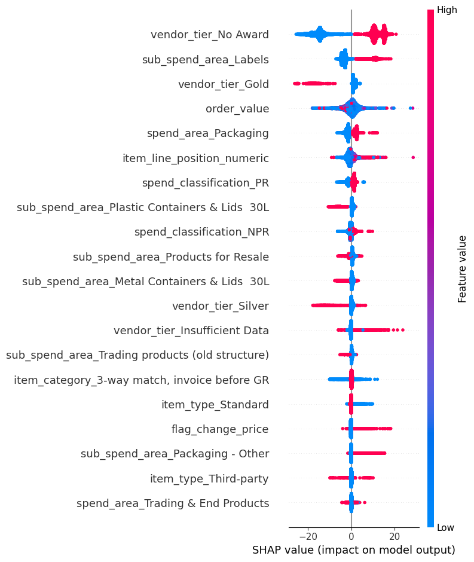

# Invoice-to-Payment Process Optimization: Throughput & Vendor Prediction

Process mining and machine learning applied to a SAP procurement dataset of a large multinational company headquartered in the Netherlands, containing 1,595,923 events across 251,734 cases ([BPI Challenge 2019](https://icpmconference.org/2019/icpm-2019/contests-challenges/bpi-challenge-2019/)) — combining process mining (PM4Py) and machine learning (scikit-learn, XGBoost) to discover processes, analyze throughput, check conformance and predict vendor performance.

## Executive Summary
- Analyzed [N] procurement cases from the BPI 2019 SAP event log using process mining and machine learning
- Discovered the as-is process with PM4Py (Inductive Miner) and identified [N] major bottlenecks/deviations through conformance checking
- Built a delay-prediction model ([algorithm], tuned with Optuna) achieving [F1 / precision / recall] on the test set
- Top predictors of delay: [feature 1], [feature 2], [feature 3] — explained via SHAP for individual-case transparency
- Practical use case: procurement teams can use the model's predictions and SHAP explanations to identify at-risk invoices early and prioritize intervention
- Business impact: reducing [specific bottleneck] could cut average case duration by [X] days, directly improving on-time payment rates and early-payment discount capture

*(Numbers above to be filled in once analysis is complete — this structure keeps the summary review-ready throughout the project.)*

## Project Overview

This project applies process mining and predictive modeling to a real-world SAP procurement event log provided by [BPI Challenge 2019](https://icpmconference.org/2019/icpm-2019/contests-challenges/bpi-challenge-2019/), covering the full pipeline from process discovery to a deployable prediction tool. The analysis follows the three classical process mining stages — **process discovery**, **conformance checking**, and **process enhancement** — and finally extends enhancement into predictive process monitoring using machine learning.

**Key steps:**
1. Load and clean the BPI 2019 event log (Notebook 1)
2. Process discovery — discover the as-is process with PM4Py (Notebook 2)
3. Conformance checking — identify deviations from the ideal process flow (Notebook 3)
4. Process enhancement — bottleneck and delay analysis using timestamp data (Notebook 4)
5. Feature engineering for delay and vendor-reliability prediction (Notebook 5)
6. Train and tune two predictive models — case-level throughput prediction (Part 1) and vendor Award tier prediction for existing and new vendors (Part 2, Models A & B) — using scikit-learn, XGBoost, and Optuna, tracked with Weights & Biases (W&B) (Notebook 6)
7. Explain model predictions with SHAP and dtreeviz (Notebook 7)

## Business Problem

The dataset originates from the [BPI Challenge 2019](https://icpmconference.org/2019/icpm-2019/contests-challenges/bpi-challenge-2019/): 
a large multinational company headquartered in the Netherlands, operating in the coatings and paints industry across 60 subsidiaries, submitted its purchase order handling process for investigation. The process owner's motivation was **compliance** — understanding not just how the process runs, but also where and how severely it deviates from expectation.

This project follows the three original questions posed by the BPI Challenge, extended with a predictive layer:

1. **Process discovery:** Is there a collection of process models that together properly describe the process captured in this data? (The challenge itself identifies at least four underlying flow types — 3-way matching with GR-based invoicing, 3-way matching without, 2-way matching and consignment.)
2. **Throughput analysis (enhancement):** What is the throughput of the invoicing process — the time between goods receipt, invoice receipt and payment (invoice clearing) — including matching the correct goods receipts to invoices when a single line item has several of each?
3. **Conformance and deviation:** Which purchase documents stand out from the log, where do they deviate from the discovered process models and how severe are these deviations — both in terms of process flow and invoice values (e.g. vendors producing disproportionate rework due to invoice errors)?
4. **Prediction (this project's extension):** Based on the findings in sections 1-3, three predictive models were developed addressing throughput and vendors' performance:
   - Part 1 — Case-Level Throughput Prediction: How long will a specific case take to clear?
   - Part 2 — Vendor Award Prediction: How reliable is an existing vendor (Model A; vendor-level) or a new vendor (Model B; order-level)? 

## Dataset

- **Source:** BPI Challenge 2019 — SAP procurement event log, published via [4TU.ResearchData](https://data.4tu.nl/articles/_/12715853/1) ([direct file download](https://data.4tu.nl/file/35ed7122-966a-484e-a0e1-749b64e3366d/864493d1-3a58-47f6-ad6f-27f95f995828), 
  `BPI_Challenge_2019.xes`, ~695 MB uncompressed)
- **License:** CC BY 4.0 (dataset) — separate from this repository's MIT license, which covers code only. Citation: van Dongen, B.F., *BPI Challenge 2019*. 4TU.ResearchData.
- **Format:** IEEE XES standard, read natively via `pm4py.read_xes()`
- **Scope:** 1,595,923 events across 251,734 cases (case ID = purchase document + item), spanning 76,349 purchase documents, 42 activities and 627 users (607 human, 20 batch/automated) — covering purchase orders submitted in 2018 across 60 subsidiaries
- **Key attributes:** Case ID, activity, timestamp, resource (user), purchasing document ID, item type, item category (3-way with/without GR-based invoicing, 2-way, consignment), vendor, company (subsidiary), spend classification text, GR-based invoice verification flag, goods receipt flag
- **Note:** The raw `.xes` file is not committed to this repository due to its size — see the link above to download it directly. `data/raw/` is excluded via `.gitignore`.

## Approach

- **Process Mining:** PM4Py for process discovery (Inductive Miner) and
  conformance checking against the expected purchase-to-pay flow
- **Segmented analysis:** Where relevant, process discovery, conformance
  checking, and duration analysis are performed both in aggregate and
  segmented by item category (the four flow types), vendor, subsidiary
  and time period — since aggregate metrics can mask meaningful variation
  across these dimensions (e.g. a company-wide average duration can look
  acceptable while masking poor performance concentrated in a few
  subsidiaries)
- **Conformance checking:** BPI 2019 lacks a formal, machine-readable
  reference (de jure) process model, a known gap also faced by both
  winning BPI Challenge 2019 submissions
  ([Augusto, Leno & Reissner, 2019](https://icpmconference.org/2019/wp-content/uploads/sites/6/2019/07/BPI-Challenge-Student-Submission-1.pdf);
  [Diba, Remy & Pufahl, 2019](https://icpmconference.org/2019/wp-content/uploads/sites/6/2019/07/BPI-Challenge-Submission-6.pdf)) —
  this project checks conformance against two baselines instead: (1) a de
  facto model discovered from the log's dominant behavior and (2) a
  lightweight de jure reference following the challenge's documented flow
  (Purchase Order → Goods Receipt → Invoice Receipt → Clear Invoice)
- **Feature Engineering:** Three feature tables built for two predictive
  analyses (Notebook 5):
  - Part 1: target `gr_to_clear_days` (Goods Receipt → Clear Invoice in
    days, continuous), similar to
    [Rząd et al. (2019)](https://icpmconference.org/2019/wp-content/uploads/sites/6/2019/07/BPI-Challenge-Submission-2.pdf);
    prediction point restricted to information known as-of-Goods-Receipt
  - Part 2: target No Award / Bronze / Silver+ (3-class), based on
    `ir_to_clear_days` (Invoice Receipt → Clear Invoice in days); tiers
    are adapted from the UK's
    [Fair Payment Code](https://www.smallbusinesscommissioner.gov.uk/fpc/code-criteria/),
    with the Silver tier's small-business sub-criterion replaced by a
    stricter 90%-within-30-days threshold, and Silver merged with Gold
    into Silver+ to resolve a small-sample problem
- **Machine Learning:** Two predictive analyses (Notebook 6) — Part 1:
  case-level throughput prediction (champion model: XGBoost,
  Optuna-tuned, tracked in W&B), cross-validated against
  [Rząd et al. (2019)](https://icpmconference.org/2019/wp-content/uploads/sites/6/2019/07/BPI-Challenge-Submission-2.pdf);
  and Part 2: vendor Award tier prediction, using separate models for
  existing vendors (Logistic Regression, Decision Tree, both logged on
  W&B) and new/thin-history vendors (champion model: Optuna-tuned Random
  Forest, logged on W&B)
- **Explainability:** SHAP for global and individual-case feature
  importance, complemented by a dtreeviz visualization of a
  representative decision tree for structural interpretability, applied
  to both champion models

## Planned Extensions

These extensions are committed and will be completed — the open question
is timing, not whether. They are deliberately decoupled from the
September 20, 2026 deadline so they do not compete with the core pipeline
under time pressure.

- **Social network analysis** — resource collaboration patterns via
  PM4Py's handover-of-work and working-together networks, cross-referenced
  with duration data to distinguish genuine bottlenecks from
  high-throughput specialists
- **Object-centric process mining** — OCEL 2.0 conversion and PM4Py's
  object-centric discovery, to more accurately capture the one-to-many
  relationships (e.g., multiple goods receipts/invoices per line item)
  that this project's single-case-notion analysis simplifies
- **Power BI Dashboard & Process.Science Integration** — a three-dashboard
  Power BI application (Process Overview, Vendor & Spend, Rework &
  Bottlenecks) incorporating this project's model predictions, alongside a
  demonstration of Process.Science's commercial process-mining visual

*See [`docs/planned-extensions.md`](docs/planned-extensions.md) for
detailed methodology, specific research questions, and citations for each
extension.*

## Key Findings — Core Analysis

The key findings are ordered along the three original questions posed by the BPI Challenge, followed by the prediction insights:

### 1. **Process discovery:** Is there a collection of process models that together properly describe the process captured in this data?

- Process discovery on the **full event log** leads to a highly
   **complex "spaghetti" model** (see `full_log_discovery.png`),
   confirming BPI 2019's known complexity (four flow types, an SRM
   sub-variant, and high-multiplicity GR/invoice cases identified in
   Notebook 1)
- A subsequent **segmented discovery** by `case:Item Category` (4 flow
   types, 77.37%/20.00%/2.26%/0.37%) reveals that the two dominant
   categories (97.37% of events combined) produce hard-to-read
   **spaghetti models** (see figures 1-2), while the two smaller categories (2.63%
   combined) lead to **cleaner, interpretable ones** — revealing the main
   cause is probably the high-multiplicity GR/invoice pattern found in
   Notebook 1, which is concentrated in the larger categories
- An analysis of known **sub-populations** showed that **excluding SRM
   cases** from the two 3-way match categories reduced case counts only
   modestly (-0.4% and -4.0% respectively). The process models remained
   visually complex, showing **"spaghetti"-like structures** —
   **SRM cases are not the main cause of model complexity**
- This segmentation directly answers the challenge's suggestion that
   which model best explains a **purchase item should be determined by the
   item's own properties: `case:Item Category`** — a genuine property of
   each item — is precisely the field used to determine which of the
   four discovered models applies to it

**Overall,** a **collection of (at least) four process models** — segmented by item
category, as the challenge itself suggests — is needed to properly
describe the process, since a single unsegmented model produces an
unreadable "spaghetti" result.


*Figure 1: "3-way match, invoice before GR" (77.37% of events): Clear "spaghetti" illustration of BPI 2019's known complexity, with dense parallel/looping structures in the middle.*



*Figure 2: "3-way match, invoice before GR — excluding SRM" Excluding SRM cases from the two 3-way match categories removed a small number of cases (before GR: 221,010 → 220,181, -0.4%; after GR: 15,182 → 14,571, -4.0%), but the resulting process models remained visually complex, similar to the originals.*

### 2. **Throughput analysis (enhancement):** What is the throughput of the invoicing process — the time between goods receipt, invoice receipt and payment (invoice clearing) — including matching the correct goods receipts to invoices when a single line item has several of each?

**Case-level throughput:** The overall throughput (median) across all cases with a valid delta is:

- **GR → Invoice Receipt:** 9.14 days (n = 210,370)
- **Invoice Receipt → Clear Invoice:** 42.05 days (n = 183,293)
- **GR → Clear Invoice (end-to-end):** 63.00 days (n = 182,808)

The **main driver of end-to-end throughput** is **Invoice Receipt → Clear Invoice** (42.05 days), representing roughly two-thirds of the median total (see 4.2.3 for methodology).

*Note on methodology:* Throughput is calculated using simplified
first-occurrence matching (see 4.2.2); the challenge's deeper question —
matching multiple GR/invoice messages within a line item — is deferred to the
planned OCPM extension.

**Event ordering:** Within "3-way match, invoice after GR" (11,128 cases),
0.00% show a negative delta — goods receipt precedes invoice receipt with no
exceptions. Within the **dominant category** (199,242 cases), 8.21% show a
**negative delta (invoice receipt before goods receipt)** — a finding worth
further investigation, as it may point to a conformance issue rather than
expected process variation.

**Activity-level bottlenecks:** Excluding SRM cases, five patterns emerged
among the top 20 transitions by occurrence and the longest-duration
transitions among pairs occurring at least 50 times (186 of 383 pairs, see
figure 3).

**Throughput by category:** A segmentation by `case:Item Category` reveals
substantial heterogeneity:

<table>
<thead>
<tr>
<th>case:Item Category</th>
<th colspan="3">gr_to_ir_days</th>
<th colspan="3">ir_to_clear_days</th>
<th colspan="3">gr_to_clear_days</th>
</tr>
<tr>
<th></th>
<th>count</th><th>median</th><th>mean</th>
<th>count</th><th>median</th><th>mean</th>
<th>count</th><th>median</th><th>mean</th>
</tr>
</thead>
<tbody>
<tr><td>2-way match</td><td>0</td><td>–</td><td>–</td><td>303</td><td>5.21</td><td>9.76</td><td>0</td><td>–</td><td>–</td></tr>
<tr><td>3-way match, invoice after GR</td><td>11,128</td><td>26.04</td><td>36.83</td><td>9,674</td><td>26.32</td><td>33.18</td><td>9,675</td><td>63.30</td><td>64.38</td></tr>
<tr><td>3-way match, invoice before GR (dominant)</td><td>199,242</td><td>8.82</td><td>17.70</td><td>173,316</td><td>42.92</td><td>49.05</td><td>173,133</td><td>62.97</td><td>65.84</td></tr>
<tr><td>Consignment</td><td>0</td><td>–</td><td>–</td><td>0</td><td>–</td><td>–</td><td>0</td><td>–</td><td>–</td></tr>
</tbody>
</table>

Both 3-way match categories converge on a similar end-to-end duration
(~63 days) despite very different internal splits — "invoice after GR"
front-loads its delay into GR→IR (26.04 days), while the dominant category's delay concentrates in IR→Clear (42.92 days).

**Variant diversity:** The dominant category ("3-way match, invoice before
GR") includes 7,835 unique process variants (221,010 cases, 4.4.1's
SRM-included scope) but shows the lowest variant density of all four
categories (3.5% variants/case, 4.4.2's SRM-excluded scope). In contrast,
"invoice after GR" and "2-way match" show the highest density (27.1% /
14.8%) despite the smallest case shares.

**Throughput by vendor:** This analysis followed two distinct approaches
leading to different results. **Top-15-by-volume** (36.3% of all cases)
shows `vendor_0135` (1.96 days) and `vendor_0104` (2.21 days) as the
**fastest** (also the #1 and #3 vendors by volume), and `vendor_0126`
(44.02 days) and `vendor_0194` (40.41 days) as the **slowest** — both over
20x slower than the fastest. **Top/bottom-15-by-median-throughput** (≥30
cases, to avoid small-sample noise) shows `vendor_0906` (38 cases, 9.05
days) and `vendor_0604` (157 cases, 9.08 days) as **fastest**, and
`vendor_1039` (32 cases, median 180 days) and `vendor_0615` (36 cases,
median 134 days) as **slowest**. As a result, vendor-level process
friction varies significantly between the fastest and slowest vendors,
and stage also matters — `vendor_0135` is fastest at GR→IR but slowest
overall (111.15 days GR→Clear), since its delay concentrates entirely in
the IR→Clear stage (105.97 days). A direct comparison could help clarify
what drives these large differences. Lastly, `vendor_0135` and
`vendor_0119` need close monitoring as they represent 11.1% of all cases
and both take over 100 days to clear — a significant business impact
given their scale.


*Figure 3: The following five patterns emerge when analyzing the top 20 transitions by occurrence and the longest-duration transitions among pairs occurring at least 50 times: Approval-related delays, Core process flow, Deviation cluster, Payment-block sub-flow, Repetitive activities (self-loop).*

### 3. **Conformance and deviation:** Which purchase documents stand out from the log, where do they deviate from the discovered process models and how severe are these deviations — both in terms of process flow and invoice values (e.g. vendors producing disproportionate rework due to invoice errors)?

**1. Which purchase documents stand out?**
- Purchase documents show **sharp, size-independent deviation
  concentration**: several documents show 97-100% of their line items
  deviating (e.g., `4507021416`: 172/172 items, 100%) — a pattern
  independently reported by another BPI Challenge 2019 team
  ([van Dyk, Kennes, Aklecha & Ramezani (2019)](https://icpmconference.org/2019/wp-content/uploads/sites/6/2019/07/BPI-Challenge-Submission-3.pdf),
  who found a document with 84 items and a 100% rework rate).
- Purchase documents follow an even more extreme long tail than vendors
  (max: 429 items); only 1 of the top 10 deviating documents also appears
  among the top 10 largest overall — confirming document-specific factors,
  not size, drive these deviations.

**2. Where are deviations, and how severe are they?**
- The **unfiltered de facto model** has a fitting rate of 99.60% — a
  nearly perfect match, confirming that Inductive Miner without noise
  filtering absorbs even rare behavior directly into the model.
- The **filtered de facto model** (`noise_threshold=0.2`) has a more
  informative fitting score of 96.16%, surfacing 8,486 deviating cases
  (3.84%) (see figure 4).
- The **de jure model** — comprising only the documented core sequence
  (PO Item → GR → Invoice Receipt → Clear Invoice) — shows just 66.96% of
  cases fitting exactly, meaning 33.04% deviate from the officially
  documented policy. Each flow type requires its own reference model,
  consistent with the challenge's Question 1 (see figure 5).

| Model | Average fitness | Perfectly fit cases |
|---|---|---|
| De facto (unfiltered) | 0.9999 | 99.60% |
| De facto (filtered, 0.2) | 0.9960 | 96.16% |
| De jure (documented policy) | 0.9020 | 66.96% |

- Response-rule violation rates increase in the **baseline process
  (3-way match, invoice before GR)** along the de jure sequence (6.58% →
  10.94% → 13.16%), partly explained by the "snapshots challenge"
  (in-progress cases at the data cutoff).
- Applying the de jure model to **"invoice after GR"** reveals a similar
  but distinct pattern (4.24% → 23.46% → 13.08%).
- Cross-referencing **all de facto deviators** and the **high-multiplicity
  deviators** against de jure rules shows two striking patterns:
  - violations are nearly 5x higher among all deviators versus baseline
    (13.16% → 64.00%) — suggesting the final invoice-clearing step is
    where genuine process friction happens (disputes, manual intervention,
    blocked payments)
  - high-multiplicity deviators are the *most* compliant group on every
    rule — "PO Item → GR" (6.58% baseline → 5.89% all deviators → 1.45%
    high-multiplicity), "GR → Invoice Receipt" (10.94% → 19.60% → 6.48%),
    and "Invoice Receipt → Clear Invoice" (13.16% → 64.00% → 7.58%) —
    indicating high-multiplicity cases deviate due to structural
    complexity and not non-compliance, motivating the planned OCPM
    extension

| Model / Group | PO Item → GR | GR → Invoice Receipt | Invoice Receipt → Clear Invoice |
|---|---|---|---|
| Baseline (all cases) | 6.58% | 10.94% | 13.16% |
| "Invoice after GR" flow type | 4.24% | 23.46% | 13.08% |
| All de facto deviators (8,486) | 5.89% | 19.60% | 64.00% |
| High-multiplicity deviators (2,349) | 1.45% | 6.48% | 7.58% |

**3. Which vendors produce disproportionate rework?**
- Among the top 100 vendors by volume (76.6% of cases), **26 unique
  vendors** appear across the three "top 10 worst" lists, with aggregate
  violation rates of 24.14% (PO→GR), 37.90% (GR→Invoice), and 24.79%
  (Invoice→Clear) — all substantially above baseline.
- `vendorID_0282` stands out with a 100% violation rate on invoice
  clearing (277/277 cases), confirmed genuine (not a truncation artifact).
- The two highest-volume vendors overall (`vendorID_0136`, `vendorID_0120`,
  13,000+ cases each) show only moderate violation rates (2.97-23.23% and
  1.79-20.54%) — indicating business volume does not drive violation rates; the worst rates concentrate among mid-sized vendors.

**On invoice values:** checking whether goods receipt values match invoice
values was not feasible with the available data (`Cumulative net worth` is
fixed per case in 99.7% of cases), but **higher-value cases do deviate
somewhat more often**.

**In conclusion**, conformance findings depend heavily on the reference
model and level of aggregation used — de facto, de jure, vendor, and
document views each surface different, complementary insights.
Document-specific factors driving deviation remain unexplained by
structural, vendor-wide, or complexity-related patterns — a candidate for
further investigation in the planned OCPM extension.



*Figure 4: Filtered de facto model (noise_threshold=0.2) with a slightly lower fitting score of 96.16%.*


*Figure 5: De jure model — comprising only the documented core sequence (PO Item → GR → Invoice Receipt → Clear Invoice) — shows that just 66.96% of all cases fitting exactly, meaning 33.04% of cases deviating from the officially documented policy.*

### 4. **Prediction (this project's extension):** 

**Part 1 - Case-Level Throughput Prediction** predicts `gr_to_clear_days` for
individual cases, with a strict "as-of-Goods-Receipt" prediction point to
prevent hindsight leakage:

- All four baseline models achieved meaningful signal (RMSE 20–25 days,
  well below the target's ~30-day standard deviation); **XGBoost** led on
  RMSE, MAE, and R² simultaneously
- Optuna tuning gave a modest, genuine improvement over the default (RMSE
  20.06 → 19.80 days on validation), confirmed on the held-out test set
  (RMSE 20.05, MAE 12.97, R² 0.574) — closely matching validation, with no
  sign of overfitting
- Segmented performance by `item_category` was consistent with the overall
  model; by `vendor_tier`, Gold vendors showed the most accurate
  predictions (RMSE 10.77) and Silver the weakest (RMSE 29.12), plausibly
  reflecting less-established or lower-volume vendor relationships
- Cross-validated against
  [Rząd et al. (2019)](https://icpmconference.org/2019/wp-content/uploads/sites/6/2019/07/BPI-Challenge-Submission-2.pdf):
  two of their three strongest predictors ("Record Subsequent Invoice,"
  "Cancel Goods Receipt") were entirely eliminated by this project's
  stricter prediction-point discipline, since neither legitimately occurs
  before Goods Receipt — where the studies do agree ("Block Purchase Order
  Item," administrative/pricing activities), the finding held
- Overall feature importance was dominated by `sub_spend_area_Labels`
  (independently confirmed as genuine: 32,645 cases, mean throughput 91.79
  vs. 58.33 days for all other cases) and `vendor_tier` — the latter
  legitimately reflecting a vendor's own completed-case history, not data
  leakage
- Applied to the 38,047 scorable unfinished cases, predicted clearing
  times varied substantially by vendor tier (Gold fastest at ~32 days,
  Insufficient Data slowest at ~106 days) — with "No Award" (68% of the
  scoring set) and "Insufficient Data" vendors flagged as the highest-impact
  groups for closer monitoring

**Champion model:** tuned XGBoost, tracked in Weights & Biases, with the
trained model and scoring predictions exported for downstream use (Power
BI dashboard, stretch goal).

**Part 2 - Vendor Award tiers** (5.1), adapted from the UK's [Fair Payment Code](https://www.smallbusinesscommissioner.gov.uk/fpc/code-criteria/),
classify 445 of 1,674 vendors into No Award/Bronze/Silver+ based on actual
payment history; the remaining 1,229 lack sufficient history (1,222) or
are structurally ineligible (7, Consignment-only).

**Model A (existing vendors)** predicts a vendor's tier from their own
aggregated case history:

- With only 445 vendors, neither Logistic Regression nor Decision Tree
  achieved strong performance (macro F1 0.455/0.416) — a genuine
  sample-size constraint, not a fixable modeling gap (confirmed via
  regularization sweeps and feature-variance checks)
- **Both models are reported rather than selecting a single champion**,
  given their distinct error profiles
- Applied to the 1,222 "Insufficient Data" vendors, the two models'
  predictions converge somewhat as history accumulates (27.1% agreement at
  1–5 cases → 66.5% at 16–30 cases), but even the most experienced
  thin-history vendors (30+ cases, n=77) show only 61.0% agreement — barely
  better than chance for a 3-class problem; given the models' overall weak
  performance, **predictions should be treated with severe caution and
  manually verified**, not used as an automatic classification

**Model B (new vendors)** predicts a vendor's likely tier from order-level
attributes alone, with no vendor-derived features:

- At Model B's much larger scale (166,447 rows), all four tested models
  substantially outperformed Model A (best: Random Forest, 0.729
  cross-validated macro F1) — data volume, not model sophistication, was
  Model A's binding constraint
- A significant methodological finding: `XGBClassifier` does not support
  `class_weight`, silently invalidating its initial comparison against the
  other three — corrected via explicit `sample_weight`, revealing
  **Random Forest as the genuine champion**
- The final model reaches 0.70 accuracy, but **macro F1 (0.50) is the more
  honest measure** given the test set's class imbalance (72% No Award) —
  raw accuracy alone would overstate performance on the harder Bronze and
  Silver+ classes
- Misclassifications concentrate between adjacent tiers (73.6% of Silver+
  errors predicted as Bronze), rarely confusing distant tiers (3.4%
  Silver+↔No Award) — a coherent, ordered error pattern
- Practical Model Usage examples confirm the model can be highly
  confident when correct (>99% probability) while transparently signaling
  uncertainty on genuine close calls. **Despite its limitations, Model B
  can meaningfully help classify new vendors — but results should be
  treated with some caution, not taken as an automatic classification,
  and manually verified for close calls**

**Together, Models A and B address complementary populations**: A for
vendors with enough history to rate reliably but not yet formally rated;
B for vendors with too little history for A to apply at all. All three of
Part 2's models are logged on Weights & Biases (Model A: Logistic
Regression, Decision Tree; Model B: Random Forest).



*Figure 6: The Predicted-vs-actual scatter plot for XGBoost shows that predictions track the diagonal closely for actual durations up to roughly 100 days, confirming genuine predictive signal across most of the data. However, extreme cases remain underpredicted for actual durations above ~120–150 days.*



*Figure 7: The top-20 features are dominated by the two categories `sub_spend_area_Labels` (importance = 0.15) and `vendor_tier` (importance = 0.10), both consistent with findings already established elsewhere in this project.*



*Figure 8: Confusion matrix of Model A: Logistic Regression is stronger for No Award (177/233 correct) but frequently overestimates Bronze vendors as Silver+ (73 of 160 Bronze vendors misclassified this way). Decision Tree is meaningfully better at correctly identifying Bronze vendors (58/160 vs. 39/160), but at the cost of more confusion between No Award and Bronze (54 No Award vendors misclassified as Bronze). Silver+ remains difficult for both models (27/52 and 25/52 correct respectively).*


*Figure 9: Confusion matrix of Model B: Errors concentrate almost entirely between adjacent tiers, not across the full spectrum: Silver+: only 23.0% of Silver+ vendors are correctly predicted as Silver+ (590 of 2,560); 73.6% (1,884 of 2,560) are predicted as Bronze, and just 3.4% (86 of 2,560) are confused with No Award, a similar adjacent-tier pattern occurs between No Award and Bronze (8,399 and 2,009 cases respectively).  In contrast, the large majority of No Award vendors are correctly predicted as such (76.6%, 30,428 of 39,730).*



*Figure 10: Model B's top 15 feature importances reveals that spend_classification_NPR and order_value are the main drivers of the model, together explaining more than half (0.58) of the model's total predictive power.*

**SHAP & dtreeviz Explainability**

SHAP and dtreeviz are applied to explain the champion models and arrive at similar conclusions:

**Part 1 (Case-Level Throughput Prediction, XGBoost):**

- Three independent methods — built-in feature importance (6.3.6), SHAP
  global summary, and dtreeviz's tree structure — all identify the same
  **two dominant features**: `vendor_tier_No Award` and `sub_spend_area_
  Labels`, with `vendor_tier_No Award` appearing as the tree's first root split
- SHAP's individual-case explanation revealed something the aggregate
  methods could not: for the test set's single highest-predicted case,
  neither dominant global feature appeared among its top drivers at all;
  instead, `item_type_Subcontracting` and `sub_spend_area_Road Packed`
  together explained nearly two-thirds of the case's entire above-baseline
  prediction — this demonstrates a core value of individual-case
  explainability: global importance describes what matters *on average*,
  while a waterfall diagram illustrates what drove this *specific* case

**Part 2, Model B (Vendor Award Prediction, Random Forest):**

- The same three-method pattern repeats: built-in importance (6.4.2),
  SHAP and dtreeviz all agree that `spend_classification_NPR` and
  `order_value` are the **two dominant drivers**, together accounting for 58%
  of the model's total feature importance
- SHAP's multi-class comparison showed this dominance holds consistently
  across all three award tiers, not just one specific class
- Individual-case explanations connected directly to 6.4.2's Practical
  Model Usage examples, providing a structural explanation for *why* the
  model was confident in two cases (99.9% and 100.0%) and genuinely
  uncertain in a third: the uncertain case's SHAP values were roughly
  four times smaller than the confident cases', with no single feature
  providing a strong signal — a concrete, visible reason for the model's
  hesitation, in a case where that hesitation turned out to be warranted

**In general**, the consistent, repeated agreement across three independent
explainability methods — for two different models, built with different
algorithms, addressing different problems — provides strong evidence that
the feature-importance patterns identified throughout this project
reflect genuine structure in the data, not artifacts of a measurement
approach or modeling choice. This methodological rigor (verifying
findings independently, where possible) has been applied across this
entire portfolio project.



*Figure 10: SHAP confirms XGBoost's built-in feature importance ranking with vendor_tier_No Award and sub_spend_area_Labels as the two most influential features.*


*Figure 11: Visualizing the first three levels of a representative tree from the XGBoost ensemble confirms the feature importance findings. The tree's very first split — its root decision — is on vendor_tier_No Award, showing that the model's first question is about this feature when classifying any new case — confirming the overall dominance of this feature, the second level contains vendor_tier_ Gold and sub_spend_area_Labels — two of the top four globally important features — further illustrating their predictive power.*


*Figure 12: SHAP confirms the built-in Random Forest feature importance ranking exactly (computed on a 5,000-row sample of the test set): spend_classification_NPR and order_value are the two most influential features for predicting Silver+.*


## Business Recommendations

## Limitations & Further Research

## Tools & Technologies

PM4Py · scikit-learn · Optuna · W&B · SHAP · dtreeviz · Power BI (incl. native Python visual integration) · Process.Science (Power BI visual) · Disco · psmineR (R, stretch goal) · Power Automate Process Mining visual (stretch goal) · Claude (Anthropic)

## Repository Structure

```
invoice-to-payment-process-optimization/
│
├── README.md
├── LICENSE
├── .gitignore
│
├── notebooks/
│   ├── 01_data_loading_cleaning.ipynb
│   ├── 02_process_discovery.ipynb
│   ├── 03_conformance_checking.ipynb
│   ├── 04_process_enhancement.ipynb
│   ├── 05_feature_engineering.ipynb
│   ├── 06_throughput_and_vendor_prediction.ipynb
│   └── 07_shap_dtreeviz_explainability.ipynb
│
├── images/
│   ├── 02_process_discovery/
│   │   ├── petri_net_3way_before_gr.png
│   │   └── petri_net_3way_before_gr_no_srm.png
│   ├── 03_conformance_checking/
│   │   ├── de_facto_model.png
│   │   └── de_jure_model.png
│   ├── 04_process_enhancement/
│   │   └── activity_bottleneck_by_theme.png
│   ├── 06_throughput_and_vendor_prediction/
│   │   ├── part1_predicted_vs_actual.png
│   │   ├── part1_xgboost_feature_importance.png
│   │   ├── model_a_confusion_matrices.png
│   │   ├── model_b_confusion_matrix.png
│   │   └── model_b_feature_importance.png
│   └── 07_shap_dtreeviz_explainability/
│       ├── part1_shap_summary.png
│       ├── part1_dtreeviz.png
│       ├── model_b_shap_summary.png
│       └── model_b_dtreeviz.png
│
└── docs/
    └── planned-extensions.md
```

## Acknowledgements

- Dataset provided ...
- Certificate: ... 🎓 (TU/e/Coursera)
- AI assistance provided by Claude (Anthropic) for code guidance, 
  interpretation refinement and documentation support

## License

This project is licensed under the MIT License — see [LICENSE](LICENSE) for details. Note: the MIT license applies to the code in this repository only. The BPI 2019 dataset is governed by its own license from the 4TU Data Repository.

## Author

Johannes Kuhaupt, LL.M., PMP
[LinkedIn](https://www.linkedin.com/in/johanneskuhaupt/) · [GitHub](https://github.com/JohannesKuh/)
